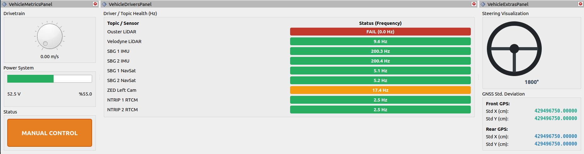

# ITUSCT RViz2 Dashboard



A custom set of **RViz2 panels built with C++ and Qt5** for real-time monitoring of an autonomous vehicle's telemetry, localization health, and high-frequency sensor drivers.

This dashboard is designed to handle **heavy ROS 2 data streams** without causing RViz GUI thread throttling or DDS packet drops.

---

## Motivation

Standard RViz panels often struggle when subscribing to **large ROS 2 messages** such as multi-megabyte LiDAR point clouds or high-frequency IMU data. When these are processed inside RViz's rendering loop, they can cause:

- UI lag
- dropped DDS packets
- inaccurate topic frequency monitoring

This project provides a **lightweight monitoring dashboard** that isolates heavy ROS 2 subscriptions from RViz's GUI thread, allowing reliable visualization of vehicle state and sensor health even under heavy data loads.

---

# Features

This package provides **three RViz2 plugins**.

---

## 1. Vehicle Metrics Panel

Monitors the **core physical state of the vehicle**.

### Drivetrain

- Live **speedometer dial**
- Displays vehicle velocity in **m/s**

### Power System

- Battery **voltage display**
- Battery **percentage indicator**
- **Color-coded safety thresholds**

| Color | Meaning |
|------|------|
| Green | Healthy |
| Yellow | Warning |
| Red | Critical |

### Vehicle State

Displays the current autonomous system status:

- `CENTERLINE`
- `LATTICE`
- `ASTAR`
- `PARKING`
- `MANUAL CONTROL`

The panel automatically switches display styling depending on whether the vehicle is in **autonomous or manual mode**.

---

## 2. Vehicle Extras Panel

Visualizes **vehicle kinematics and localization confidence**.

### Steering Visualization

- Real-time **anti-aliased steering wheel rendering**
- Displays **current steering angle**
- Smooth graphical representation of wheel rotation

### GNSS Standard Deviation

Calculates **position uncertainty** from GPS covariance matrices.

Displayed values include:

- Front GPS **Std X**
- Front GPS **Std Y**
- Rear GPS **Std X**
- Rear GPS **Std Y**

Formula used:

```
Standard Deviation (cm) = sqrt(Variance (m²)) × 100
```

This gives a quick visual indication of **localization quality**.

---

## 3. Driver / Topic Health Panel

An advanced **multi-threaded ROS 2 topic frequency monitor** designed for high-bandwidth systems.

### Zero-Copy Architecture

Uses:

- `rclcpp::GenericSubscription`
- `rclcpp::SerializedMessage`
- a **dedicated ROS 2 Context**
- a **MultiThreadedExecutor**

This allows monitoring of:

- **5MB LiDAR point clouds**
- **200Hz IMU data**
- other high-frequency topics

with **near-zero CPU overhead**, completely bypassing RViz's **30 FPS rendering loop**.

### Exponential Moving Average (EMA)

Topic frequencies are stabilized using **EMA smoothing**, producing clean and stable Hz readings similar to:

```
ros2 topic hz
```

without UI flickering.

### Status Colors

Each topic automatically changes color depending on its frequency:

| Status | Meaning |
|------|------|
| 🟢 Green | Healthy |
| 🟠 Orange | Warning |
| 🔴 Red | Critical / Dead |

---

# Prerequisites

- **ROS 2 Humble**
- **Qt5**
- Custom vehicle messages (`gae_msgs`)
- Standard ROS 2 messages

### Required packages

```
qtbase5-dev
std_msgs
sensor_msgs
geometry_msgs
```

---

# Installation

Clone this repository into the `src` folder of your ROS 2 workspace.

```bash
cd ~/your_ros2_ws/src
git clone https://github.com/virdult/rviz_custom_panel.git
cd ..
```

Install dependencies and build:

```bash
rosdep install --from-paths src --ignore-src -r -y
colcon build --symlink-install --packages-select rviz_custom_panel
```

---

# Usage

Source your workspace:

```bash
source install/setup.bash
```

Launch RViz2:

```bash
rviz2
```

Add the panels:

1. Open **Panels → Add New Panel**
2. Expand `rviz_custom_panel`
3. Add the following panels:

```
VehicleMetricsPanel
VehicleExtrasPanel
VehicleDriversPanel
```

---

# Repository Structure

```
rviz_custom_panel
├── include
│   └── vehicle_metrics_panel.hpp
│
├── src
│   └── vehicle_metrics_panel.cpp
│
├── images
│   └── dashboard.png
│
├── plugins.xml
├── CMakeLists.txt
├── package.xml
├── LICENSE
├── README.md
└── .gitignore
```

---

# License

This project is licensed under the **Apache License 2.0**.

See the `LICENSE` file for details.

---

# Maintainer

**virdult**

virdult@gmail.com
